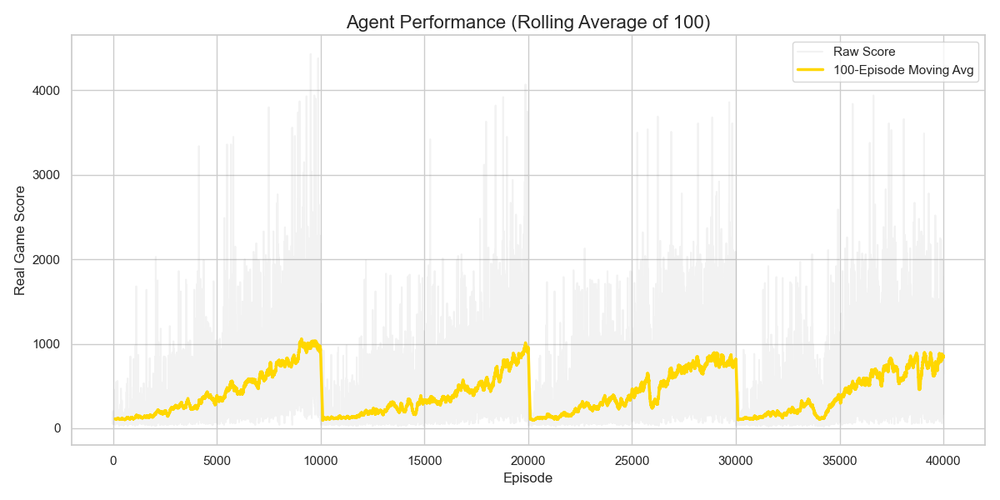
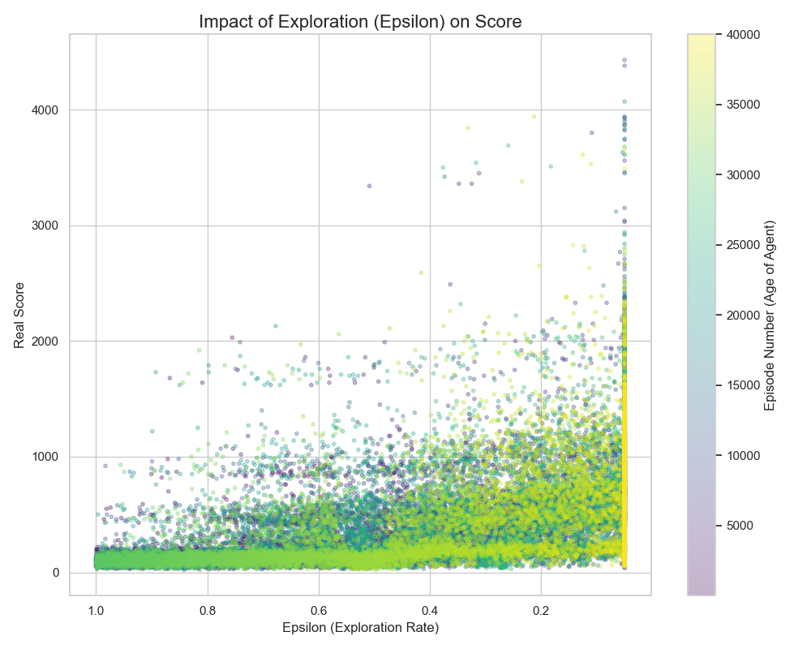
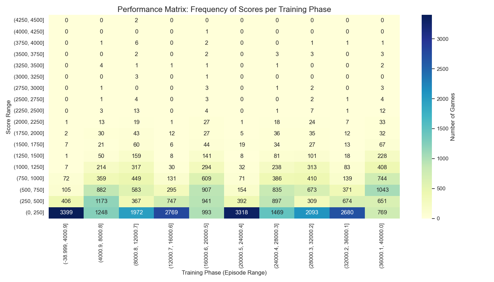

# Conquering the Maze: Ms. Pac-Man AI Agent

## Project Overview
This project trains an autonomous AI agent to play *Ms. Pac-Man* using Deep Reinforcement Learning (DQN). The agent learns to navigate the maze, avoid ghosts, and maximize its score using only raw pixel inputs from the game screen.

**Submission for:** Option A (Machine Learning Web App)

## Features
* **Deep Q-Network (DQN):** Uses Convolutional Neural Networks (CNNs) to process game frames.
* **Hardware Acceleration:** Training pipeline optimized for NVIDIA RTX 3080 (CUDA).
* **Web Interface:** A Flask-based web application to stream the agent's gameplay to a browser.
* **Cyclical Exploration:** Custom epsilon decay strategy to prevent local optima.

## File Structure
* `app.py`: The Flask web server.
* `MsPacman.py`: The main training script.
* `pacman_wrappers.py`: Custom environment wrappers for reward shaping.
* `templates/index.html`: The frontend UI.
* `mspacman_*.pth`: The trained model weights.

## How to Run

1.  **Install Dependencies:**
    ```bash
    pip install -r requirements.txt
    ```

2.  **Run the Web App:**
    ```bash
    python app.py
    ```

3.  **View the Agent:**
    Open your browser to `http://localhost:5000` to watch the AI play live.

## Results
* **Training Duration:** 40,000 Episodes
* **Best Score:** 3399



